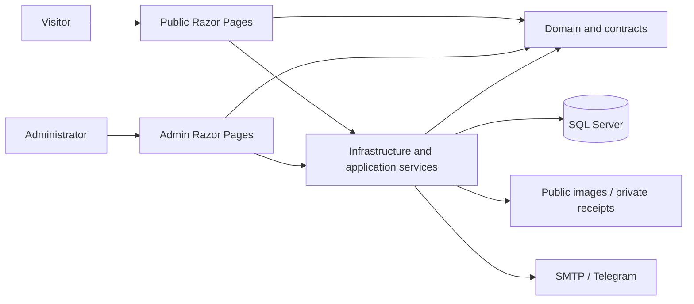

# Personal Brand Platform

[](https://github.com/sobhan-s-dehkordi/personal-brand-platform/actions/workflows/ci.yml)


A bilingual personal website and learning platform built with **ASP.NET Core**, **Razor Pages**, and **SQL Server**. It brings a developer portfolio, technical writing, open courses, and live workshop reservations into one application, with a separate English-language administration panel.

English and Persian content are edited together but stored as separate records. Visitors can read and learn without creating an account.

## What it does

- **Portfolio and writing** — projects, screenshots, technology tags, articles, rich text, and optional related courses.
- **English and Persian** — LTR/RTL public pages, a single bilingual editor, atomic saves, and independent visibility for each language.
- **Free courses** — ordered lessons, written explanations, resources, and optional YouTube videos with a playback fallback.
- **Live workshops** — separate capacity, pricing, schedules, and reservations per language; temporary seat holds and receipt review.
- **Editorial administration** — publication states, featured content, media uploads, site copy, audience records, and administrator accounts.
- **Audience and consent** — contact deduplication, enrollments, explicit newsletter opt-in, and unsubscribe confirmation.
- **Operational notifications** — a database-backed outbox with retries for SMTP email and administrator Telegram messages.
- **Search visibility** — canonical URLs, localized metadata, translation-aware links, structured data, and a sitemap that excludes hidden content.

Workshop payments use an **offline bank-transfer and receipt-review workflow**. This project does not process card payments or automatically verify bank transfers.

## Architecture

A modular monolith with two web entry points and a shared domain and database:



```text
src/
  PersonalBrand.Core/             Domain rules, entities, contracts
  PersonalBrand.Infrastructure/   EF Core, migrations, Identity, services, storage
  PersonalBrand.Web/              Bilingual public website
  PersonalBrand.Admin/            Protected English administration interface
tests/
  PersonalBrand.UnitTests/        Domain and utility tests
  PersonalBrand.IntegrationTests/ SQL Server, migrations, concurrency, sanitization
  PersonalBrand.FunctionalTests/  Real Razor Page and authenticated admin flows
docs/                            Architecture and operating guides
tools/                           Publication checks and setup scripts
```

Core has no ASP.NET Core or EF Core dependency. The public and admin applications do not reference each other. Capacity-sensitive operations use SQL Server transactions and row locks; reservation records also have a rowversion concurrency token.

## Run locally

### Prerequisites

- .NET 10 SDK
- SQL Server 2022 or later; a local SQL Server Developer instance is suitable
- Git and PowerShell 7 for the publication guardrails
- A trusted development HTTPS certificate

The checked-in development settings use a local SQL Server instance with **Windows authentication** and a dedicated `PersonalBrandDevelopment` database. For Linux, containers, or another server, supply a connection string through User Secrets or environment variables for **both applications**.

```powershell
git clone https://github.com/sobhan-s-dehkordi/personal-brand-platform.git
cd personal-brand-platform

# Install the pinned scanner and enable checks in this clone before committing.
pwsh -File tools/Initialize-Repository.ps1

dotnet restore PersonalBrand.sln
dotnet tool restore
dotnet dev-certs https --trust
dotnet build PersonalBrand.sln --no-restore

# Development-only sample content; no administrator is created by this command.
dotnet run --project src/PersonalBrand.Admin -- --migrate --seed
```

For a different SQL Server, configure `ConnectionStrings:DefaultConnection` in each project's User Secrets. Never put database passwords in a tracked settings file. Production must validate the database server certificate; the development example's `TrustServerCertificate=True` is only for local use.

Start the two apps in separate terminals:

```powershell
dotnet run --project src/PersonalBrand.Web
dotnet run --project src/PersonalBrand.Admin
```

| Application | Local address |
| --- | --- |
| English website | [localhost:7001/en](https://localhost:7001/en) |
| Persian website | [localhost:7001/fa](https://localhost:7001/fa) |
| Admin sign-in | [localhost:7002](https://localhost:7002/Account/Login) |

### Create the first administrator

There is no public administrator registration endpoint or default account. Set `AdminSeed:Email` and `AdminSeed:Password` with the Admin project's User Secrets, or supply `AdminSeed__Email` and `AdminSeed__Password` through a protected environment. Choose a unique password with at least 12 characters, uppercase/lowercase letters, a number, and punctuation.

```powershell
dotnet run --project src/PersonalBrand.Admin -- --create-admin

# Remove the one-time setup password after provisioning.
dotnet user-secrets remove "AdminSeed:Password" --project src/PersonalBrand.Admin
```

Re-running this setup does not reset an existing password. Additional administrators can be created in the authenticated admin panel.

## Editing content

Create an article, project, course, or workshop and complete both language panels. **Save both languages** writes two separate records in one transaction. The content list uses the English title; that entry opens both translations.

- Both titles and bodies are required, even for a hidden language.
- A language appears publicly only when its visibility checkbox is enabled and its status is `Published`.
- Lessons and workshop sessions also use paired editors.
- Workshop capacity and reservations are independent for English and Persian.
- **Has related courses** reveals the course picker. Disabling it clears that language's links when saved.
- Homepage copy, biography, contact links, page bodies, and payment instructions are editable. Navigation, button labels, and interface messages remain fixed.

Hiding a workshop prevents new public access and registration. It does not cancel existing reservations or revoke participants' private reservation links.

## Configuration and deployment

Use User Secrets during development and a secret manager or protected environment in production.

| Setting | Purpose |
| --- | --- |
| `ConnectionStrings:DefaultConnection` | Shared SQL Server database |
| `Site:BaseUrl` | Public HTTPS address used for links |
| `AllowedHosts` | Explicit hostnames for each application |
| `Storage:Root` | Shared storage outside `wwwroot` |
| `Security:DataProtectionPath` | Persistent private admin cookie keys |
| `WorkshopReservation:HoldDurationMinutes` | Temporary seat-hold duration |
| `Email:*` | SMTP delivery settings |
| `Telegram:BotToken`, `Telegram:ChatId` | Administrator notifications |

Public images and private receipts live in separate storage subdirectories. Neither uploads, receipt files, database backups, nor cookie-encryption keys belong in Git.

Applications do **not** apply production migrations automatically at startup. Run a controlled migration job before starting both applications:

```powershell
dotnet ef database update --project src/PersonalBrand.Infrastructure
```

The EF design-time factory reads `ConnectionStrings__DefaultConnection`. It does not load application User Secrets. Production runtime accounts should have fewer database privileges than the migration account.

A development Docker Compose configuration is included. Copy `.env.example` to `.env`, provide your own SQL and certificate passwords, and export a development certificate into the ignored `.certs` directory before starting it. The Compose configuration uses SQL Server Developer edition and is intended for local development, not a production deployment recipe.

## Tests and CI

```powershell
dotnet test PersonalBrand.sln
```

Integration and functional tests use a real SQL Server. Set `PERSONALBRAND_TEST_SQL` for an alternate test instance; the tests create uniquely named disposable databases and remove them afterward. The test account needs permission to create and drop those databases.

Coverage includes bilingual transactions and visibility, existing-data migrations, authorization and CSRF, receipt uploads, independent workshop reservations, consent, and concurrent capacity limits.

GitHub Actions runs publication checks and the full test suite. CI creates an isolated SQL Server container with a freshly generated, masked password; no permanent repository database secret is required. CI does not upload database files or test-output artifacts.

## Safe publishing

This repository uses multiple safeguards:

1. A restrictive `.gitignore` excludes local data and generated files.
2. An explicit path allowlist and reviewed binary hashes reject unexpected staged files, including force-added files.
3. Pre-commit and pre-push hooks run a pinned, checksum-verified Gitleaks scanner. Pre-push checks include commit history.
4. CI repeats the publication checks and tests them against deliberately unsafe examples.
5. GitHub secret scanning, push protection, and protected-branch checks provide additional server-side controls when enabled on the repository.

After every fresh clone, run `tools/Initialize-Repository.ps1`: Git does not automatically install repository hooks. For normal updates, review and commit your changes on a branch, then run:

```powershell
pwsh -File tools/Publish.ps1
```

No scanner can guarantee that arbitrary future changes contain no confidential information. Never bypass a hook, disable push protection, or upload files through GitHub's web editor without review. CI runs after a push; it cannot undo a public disclosure. See [Safe publishing](docs/SAFE-PUBLISHING.md) and [Security policy](SECURITY.md).

## Documentation

- [Architecture and security boundaries](docs/ARCHITECTURE.md)
- [Workshop reservation lifecycle](docs/WORKSHOP-RESERVATION.md)
- [Audience and consent model](docs/AUDIENCE-AND-CONSENT.md)
- [Admin editing and operations](docs/ADMIN-GUIDE.md)
- [Safe publishing](docs/SAFE-PUBLISHING.md)
- [Contributing](CONTRIBUTING.md)

## Third-party components

Bootstrap, jQuery, jQuery Validation, Quill, Inter, and Vazirmatn include their upstream notices alongside the vendored files. NuGet dependencies retain their respective licenses. No additional license for the first-party code is granted by making this repository public.
