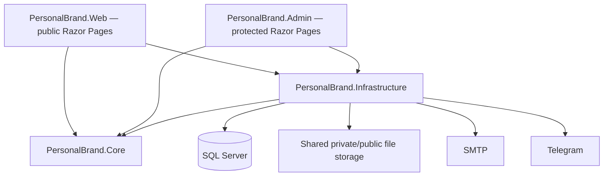
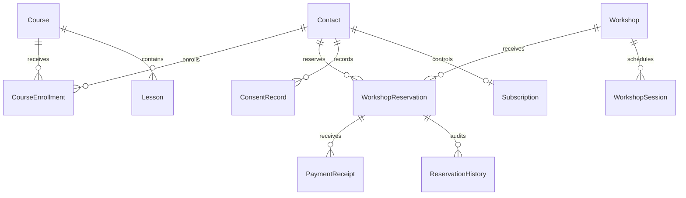

# Architecture

## Boundaries

This is a modular monolith with two deployment entry points, a shared domain, and a shared SQL Server schema. Both entry points use ASP.NET Core Razor Pages.

Arrows above are project/integration dependencies. Core references no EF, ASP.NET, database, transport, or file-system implementation. Web and Admin do not reference each other. Infrastructure contains the Identity DbContext, entity configurations, migrations, adapters, and application-service implementations. EF is used directly for read models in PageModels; a generic repository over every EF operation would add little value here. Mutating audience and reservation workflows depend on explicit Core service interfaces.

## Domain

Articles, courses, projects, and workshops share a CLR content base but map to independent tables. Language + slug is unique within each content table. TranslationGroupId links the English and Persian rows; admin forms require both and save them in a single transaction. A separate IsVisible flag controls public access independently from publication status. Lessons and sessions also have translation groups, with their own language visibility. Workshop capacities and reservations remain attached to each separate language record. Lessons belong to courses; sessions belong to workshops. Projects have normalized technologies and screenshots; articles have tags and related courses.

Domain-assigned GUIDs are configured as ValueGeneratedNever, including children appended to tracked aggregates. Identity retains its own mapping. Rowversion protects reservations against concurrent writes; workshop-row locks serialize all capacity-affecting workflows.

## SQL Server

One Identity-enabled DbContext applies separated IEntityTypeConfiguration mappings from Infrastructure. Unique indexes cover localized slugs, normalized contact email, course/contact enrollment, subscription contact/token, reservation reference/access token, lesson course/slug/order, session workshop/number, and setting key. Capacity/status/deadline indexes support availability queries. Decimal amounts use precision 18,2; timestamps use DateTimeOffset in UTC. Foreign keys preserve transaction history by restricting destructive course/workshop/contact deletes.

There is no runtime migration-on-startup. A controlled Admin CLI migration command or reviewed idempotent script precedes both app deployments. Integration tests migrate fresh SQL Server databases.

## Public presentation

Culture is constrained to en/fa in routes. Persian uses RTL and alternate homepage ordering; English emphasizes engineering/projects. Razor output encoding is the default. Markdown disallows raw HTML and passes through an allowlist sanitizer. The application has local Bootstrap/custom CSS and vanilla JavaScript for code copying/highlighting. YouTube is an optional privacy-enhanced iframe, with written lessons and fallback text always present.

Lists use database-side paging. Public pages filter publication state. Sitemap exposes only public published content and public informational routes. Canonical, descriptions, OpenGraph/Twitter, translation-aware hreflang, and escaped JSON-LD are produced server-side.

## Security

Admin uses its own Identity cookie, Administrator policy, lockout, and no registration page. All pages except login/access-denied/error require authorization. Antiforgery protects POSTs in both apps, cookies are HttpOnly/Secure, and safe return URLs prevent open redirects. HTTPS, HSTS in production, CSP, nosniff, and no-referrer are configured. Admin/reservation responses avoid caching. Public forms have bounded input and per-IP rate limiting; enrollment includes a honeypot.

Reservation access is a 256-bit random capability token separate from the human reference. Numeric/sequential identifiers cannot retrieve public reservations. Treat this URL as private, avoid logging request URLs, and configure monitoring accordingly.

Uploads check size, extension and signatures, decode with SkiaSharp under a 16-megapixel limit, and are rewritten as PNG to remove metadata/trailing payloads. Random server keys prevent traversal. The public media handler can only access the public subdirectory. Private receipts are streamed only through the authenticated review page.

SMTP credentials, Telegram bot token, connection strings, and initial admin credentials remain outside source control. Site settings expose only content/payment display values.

## Background work

Admin hosts expiration cleanup and notification dispatch. Capacity remains correct with cleanup stopped because availability excludes expired pending holds. Every expiration gets a domain audit record. Notifications form a SQL transactional outbox; a transaction-scoped application lock serializes dispatch across instances. Failed sends back off. Remote delivery is at-least-once; no distributed exactly-once guarantee is claimed.

## Operational configuration

Use a shared absolute storage path, shared schema, separate hosts/cookies, persisted admin keys, validated TLS, least-privilege runtime SQL users, and database/filesystem backups. Deploy SMTP/Telegram configuration before live reservations. Seed data is development-only and the owner's actual identity, bank details, resume, and privacy-retention policy must be supplied by the operator.

