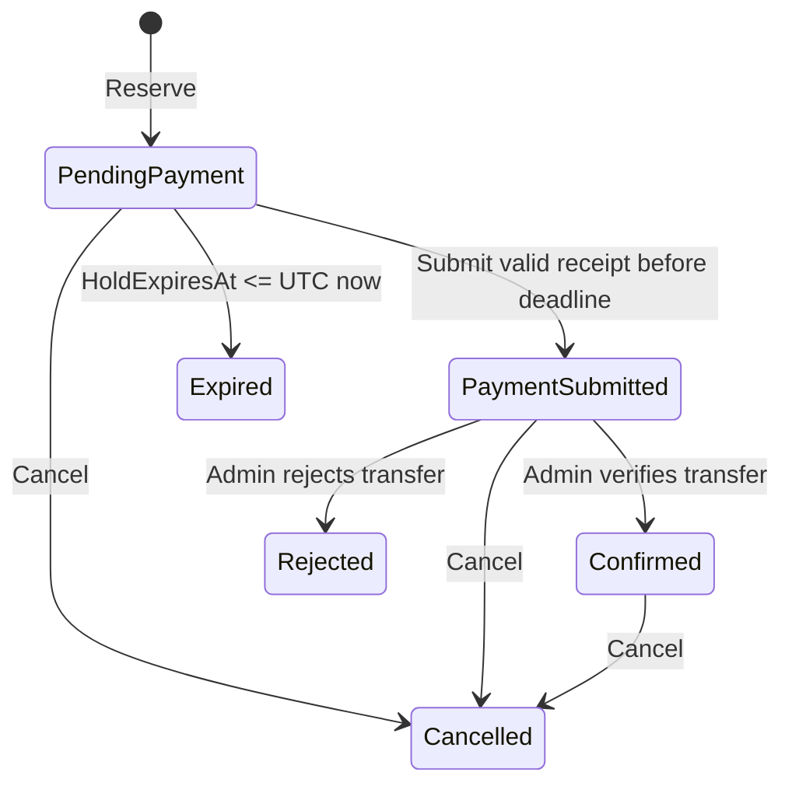

# Workshop reservations

## State machine

Only domain methods can change status. Confirming an unpaid, rejected, expired, or cancelled reservation is invalid. Receipt submission at the exact deadline is rejected. A rejected/cancelled reservation cannot be resurrected; create a new reservation through normal capacity checks. Every transition appends ReservationHistory.

## Capacity invariant

Occupied = Confirmed + PaymentSubmitted + PendingPayment where HoldExpiresAt > now.

PaymentSubmitted holds the seat until review; it does **not** expire automatically, because money may already have been transferred. PendingPayment expires after the configured 120-minute default. The domain and SQL availability predicate agree at the exact expiration boundary. Full capacity is computed; an expired hold can reopen a workshop that remains Open. An operator-set Full/Closed/Cancelled status blocks new reservations.

## SQL Server strategy

1. Begin a SQL Server transaction.
2. Read the workshop using `WITH (UPDLOCK, HOLDLOCK)` by its primary key.
3. Evaluate its publication/registration window and the active reservation count.
4. Acquire a transaction-scoped sp_getapplock for the normalized email digest; reuse/create Contact.
5. Reject an existing active reservation for the same contact and workshop.
6. Insert the reservation, audit, optional consent, and operational notifications.
7. Save and commit.

The workshop update lock is held until commit and is incompatible with another allocator's update lock. Thus different callers cannot both observe the last available seat. Locking the known parent row is simpler than relying on range locks over a changing child count. Different workshops can proceed concurrently. All reservation submissions, reviews, cancellations, workshop capacity edits/cancellation, and expiration cleanup acquire this same workshop lock before touching reservations. Consistent lock ordering is workshop, then contact where needed. A reservation rowversion supplies an additional concurrency guard.

The contact lock uses a SHA-256 digest of normalized email, not the email itself. It protects missing as well as existing rows. Unique constraints remain the final data-integrity guard. Lock waits are bounded; a database failure rolls back the transaction. No in-process lock is used for correctness.

**Verified test:** 20 concurrent tasks, independent DbContexts/connections, workshop capacity 7 → exactly 7 successful reservations and 7 active rows.

## Payment

Public reservation pages expose the price/currency snapshot, deadline, reference, and configured card-to-card details. Visitors transfer outside the application and submit a tracking number plus an image. An unpredictable access token protects the page; it is not a receipt-download credential.

Receipt files are private and validated/rewritten. The file is stored before the short database transaction; normal transaction failure removes it. A hard process crash between file write and commit can leave an orphan file, which operators should reconcile against StorageKey records during maintenance. Never delete files simply because a notification failed.

Submission, state change, audit, and outbox messages commit together. An admin inspects the image, verifies the real transfer externally, and confirms/rejects. Cancellation after an actual transfer is an operational action; arrange refunds outside this application because no gateway/refund integration exists. Notifications do not assert that a refund occurred.

## Expiration and operations

Admin's minute-level cleanup persists Expired and audit entries in batches, but is not required for capacity correctness. Keep submitted payments under timely review. Monitor the notification queue and retry after fixing provider configuration. Never log receipt bytes, access links, bank details, or full contact information.

